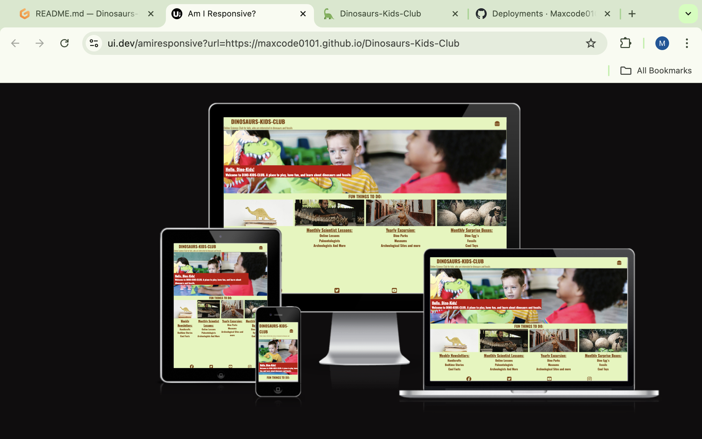
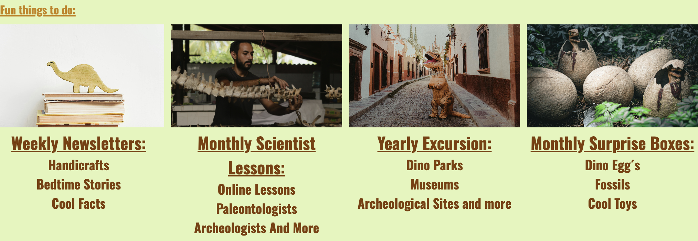
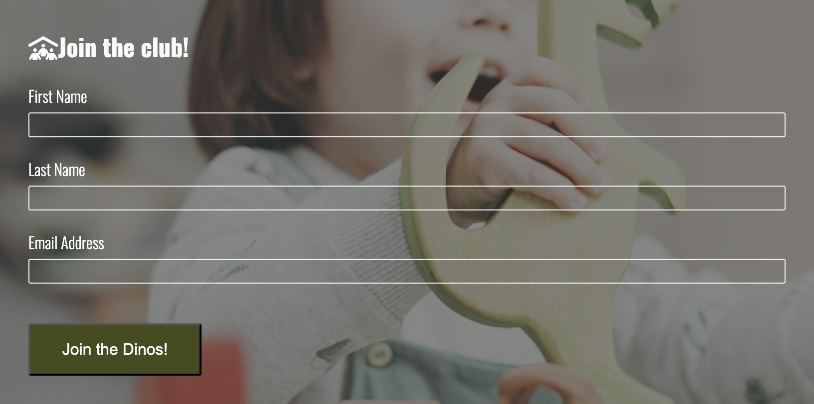

# [DINOSAURS KIDS CLUB](https://maxcode0101.github.io/Dinosaurs-Kids-Club)

Name of the Project: Dinosaurs-Kids-Club

Dinosaurs-Kids-Club is an Online-Science-Club for children (and their parents) who are interested in dinosaurs and fossils. It´s an exciting place for kids to have fun, play and learn everything about dinosaurs, their history and about fossils. Parents can sign-up and will receive a weekly newsletter with cool stories about dinos, instructions for handicrafts, bedtime-stories and similiar. We host volunteerly teaching scientist who´re doing a monthly online lesson about dino-topics. Once a year we´re organising an excursion, this could be the visit of a museum, an archeological site or a dino-adventure-park. Every member is receiving a monthly surprise gift inside a dino egg. The surprise box can contain, dino games or toys. 
In this section, you will include a few paragraphs providing an overview of your project.

https://ui.dev/amiresponsive?url=https://maxcode0101.github.io/Dinosaurs-Kids-Club

## UX

I started designing the about-us page, by thinking about what is most important for the user on the first view and how can the benefit of using the site be displayed most efficiently. Afterwards I designed a color-scheme and placed the elements in an appealing way. I added the content I was thinking about and some interactive elements. Afterwards I created the sign-up page, and the meet the dinosaurs page, which should give the user some idea what to expect from full access to the member section and deliver some knowledge about the the topic of the page.

### Colour Scheme

- `#7D3E00` used for primary text.
- `#E2F6B9` used for primary background.
- `#FFFFFF` used for secondary text.
- `rgb(190, 4, 4)` used for secondary highlights.

I used [coolors.co](https://coolors.co/7d3e00-e2f6b9-ffffff-be0404) to generate my colour palette.

### Typography

- [Oswald](https://fonts.google.com/specimen/Oswald) was used for the primary headers and titles.

- [Roboto](https://fonts.google.com/specimen/Roboto) was used for all other secondary text.

- [Font Awesome](https://fontawesome.com) icons were used throughout the site, such as the social media icons in the footer and the icon at the sign-up form.

### Existing Features

- **About us**

    - About us / gives an overview of benefits for members.

- **Member**

    - Member / contents the sign up form which needs to be filled out to get access.

- **Meet the dinosaurs**

    - Meet the dinosaurs / preview of content which the user can expect after becoming a member.

### Future Features

- Videochannel with exciting documentaries and experiments to do at home.

## Tools & Technologies Used

-  used to generate README and TESTING templates.
-  used for version control. (`git add`, `git commit`, `git push`)
-  used for secure online code storage.
- ⚠️⚠️ CHOOSE ONLY ONE <-- delete me ⚠️⚠️
-  used as a cloud-based IDE for development.
-  used as a cloud-based IDE for development.
-  used as my local IDE for development.
-  used for the main site content.
-  used for the main site design and layout.
-  used for hosting the deployed front-end site.
-  used for the icons.

## Testing

> [!NOTE]  
>Please visit the [TESTING.md](TESTING.md) file.

## Deployment

The site was deployed to GitHub Pages. The steps to deploy are as follows:

- In the [GitHub repository](https://github.com/Maxcode0101/Dinosaurs-Kids-Club), navigate to the Settings tab 
- From the source section drop-down menu, select the **Main** Branch, then click "Save".
- The page will be automatically refreshed with a detailed ribbon display to indicate the successful deployment.

The live link can be found [here](https://maxcode0101.github.io/Dinosaurs-Kids-Club)

### Local Deployment

This project can be cloned or forked in order to make a local copy on your own system.

#### Cloning

You can clone the repository by following these steps:

1. Go to the [GitHub repository](https://github.com/Maxcode0101/Dinosaurs-Kids-Club) 
2. Locate the Code button above the list of files and click it 
3. Select if you prefer to clone using HTTPS, SSH, or GitHub CLI and click the copy button to copy the URL to your clipboard
4. Open Git Bash or Terminal
5. Change the current working directory to the one where you want the cloned directory
6. In your IDE Terminal, type the following command to clone my repository:
	- `git clone https://github.com/Maxcode0101/Dinosaurs-Kids-Club.git`
7. Press Enter to create your local clone.

Alternatively, if using Gitpod, you can click below to create your own workspace using this repository.

Please note that in order to directly open the project in Gitpod, you need to have the browser extension installed.
A tutorial on how to do that can be found [here](https://www.gitpod.io/docs/configure/user-settings/browser-extension).

#### Forking

By forking the GitHub Repository, we make a copy of the original repository on our GitHub account to view and/or make changes without affecting the original owner's repository.
You can fork this repository by using the following steps:

1. Log in to GitHub and locate the [GitHub Repository](https://github.com/Maxcode0101/Dinosaurs-Kids-Club)
2. At the top of the Repository (not top of page) just above the "Settings" Button on the menu, locate the "Fork" Button.
3. Once clicked, you should now have a copy of the original repository in your own GitHub account!

## Credits

codeinstitute (love-running project):
 -Boilerplate Html
 -Footer
 -Navbar
 -Signup-Form

### Content

grid-container:
https://www.w3schools.com/css/css_grid_container.asp

Meet-the-dinosaurs-page - text and pictures:
https://www.activewild.com/famous-dinosaurs/

| Source | Location | Notes |
| --- | --- | --- |
| [Markdown Builder](https://tim.2bn.dev/markdown-builder) | README and TESTING | tool to help generate the Markdown files |
| [W3Schools](https://www.w3schools.com/howto/howto_js_topnav_responsive.asp) | entire site | responsive HTML/CSS/JS navbar |
| [W3Schools](https://www.w3schools.com/howto/howto_css_modals.asp) | contact page | interactive pop-up (modal) |
| [W3Schools](https://www.w3schools.com/css/css3_variables.asp) | entire site | how to use CSS :root variables |
| [YouTube](https://www.youtube.com/watch?v=YL1F4dCUlLc) | leaderboard | using `localStorage()` in JS for high scores |
| [YouTube](https://www.youtube.com/watch?v=u51Zjlnui4Y) | PP3 terminal | tutorial for adding color to the Python terminal |

### Media

| Source | Location | Type | Notes |
| --- | --- | --- | --- |
| [Pexels](https://www.pexels.com) | images on about-us and background image for sign-up-form | 
| [Favicon](https://favicon.io) | favicon on all pages |

### Acknowledgements

- I would like to thank my Code Institute mentor, [Tim Nelson](https://github.com/TravelTimN) for his support throughout the development of this project.
- I would like to thank the [Code Institute](https://codeinstitute.net) tutor team for their assistance with troubleshooting and debugging some project issues.
- I would like to thank the [Code Institute Slack community](https://code-institute-room.slack.com) for the moral support; it kept me going during periods of self doubt and imposter syndrome.