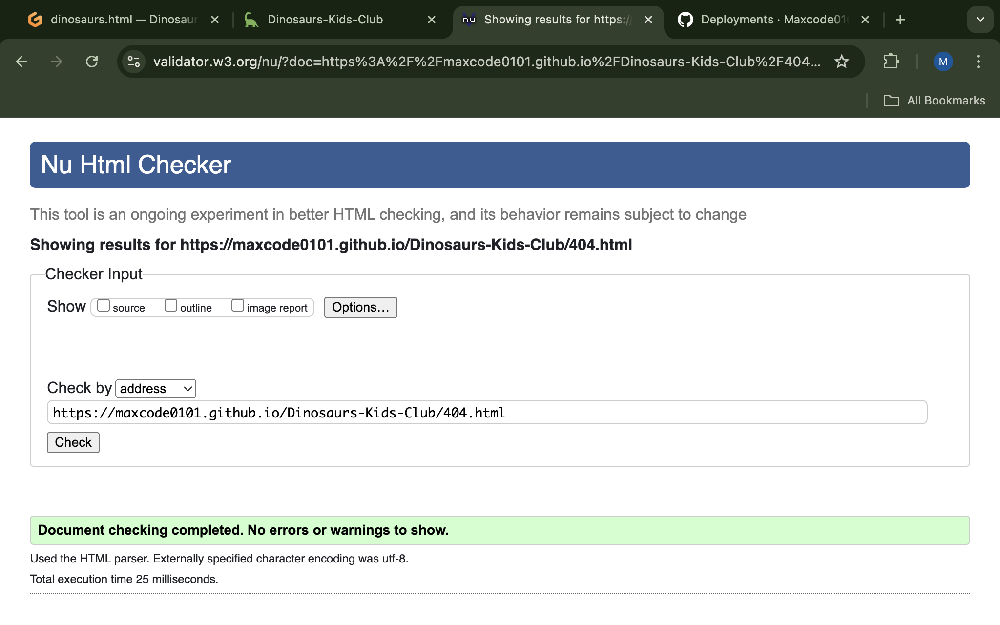
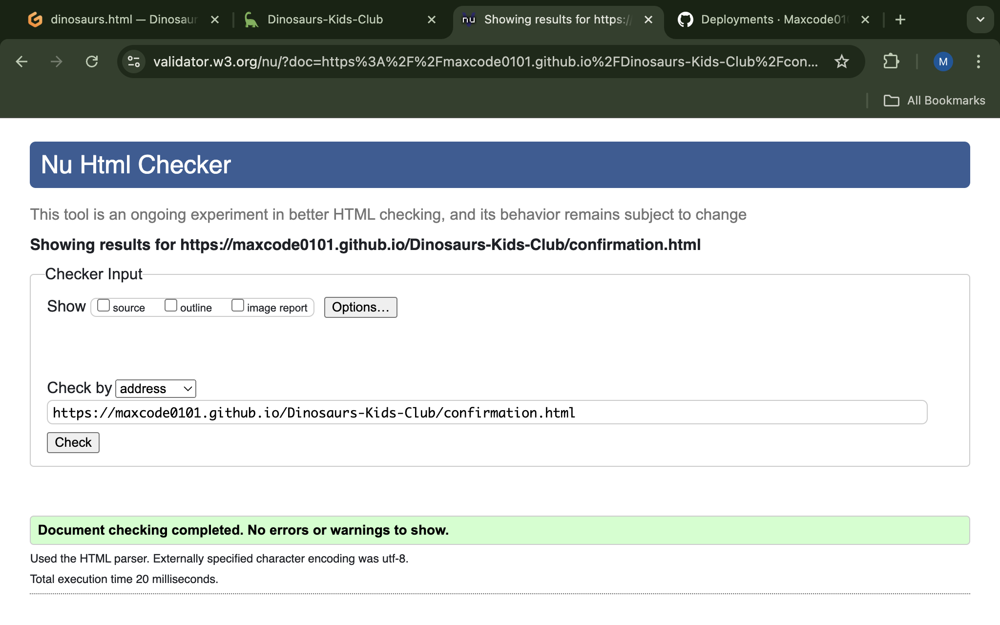
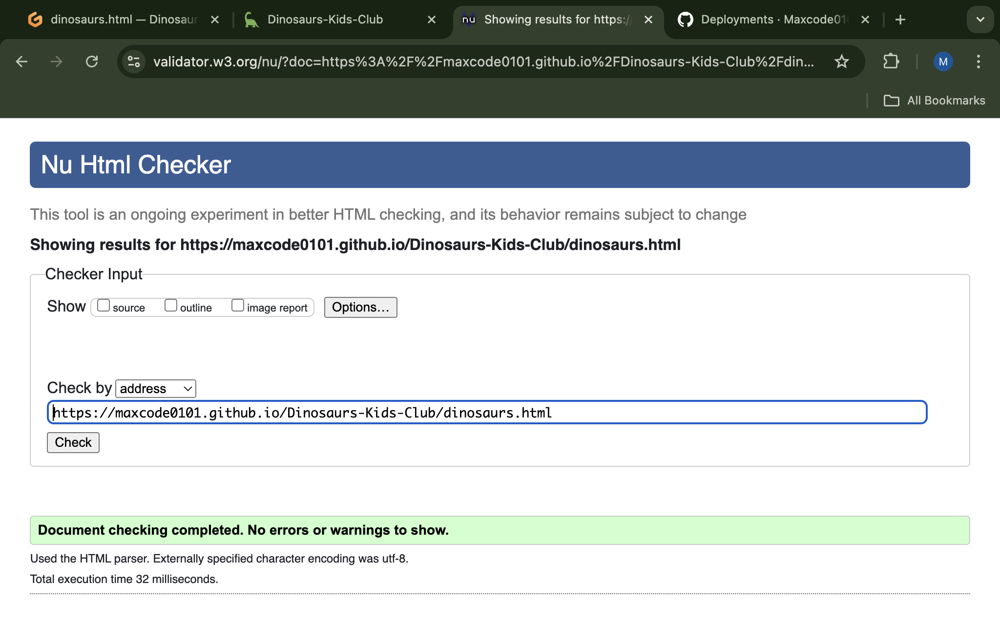
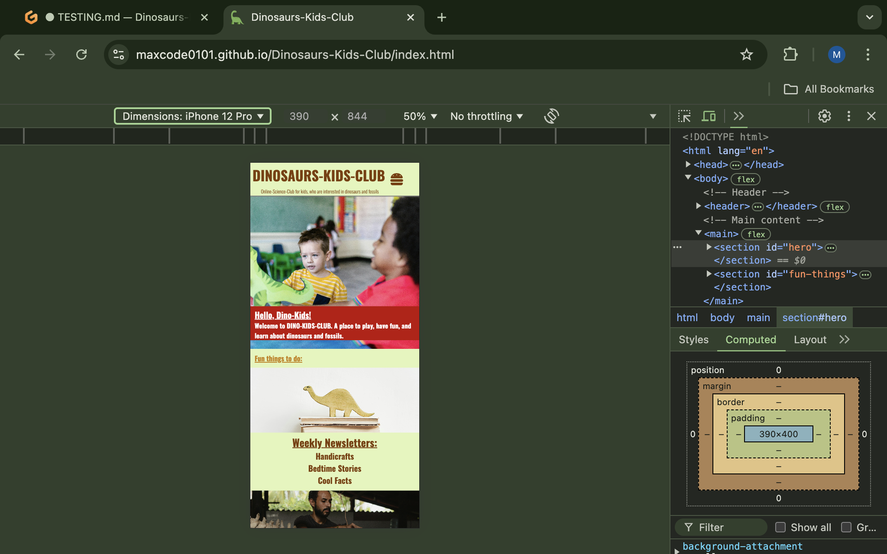
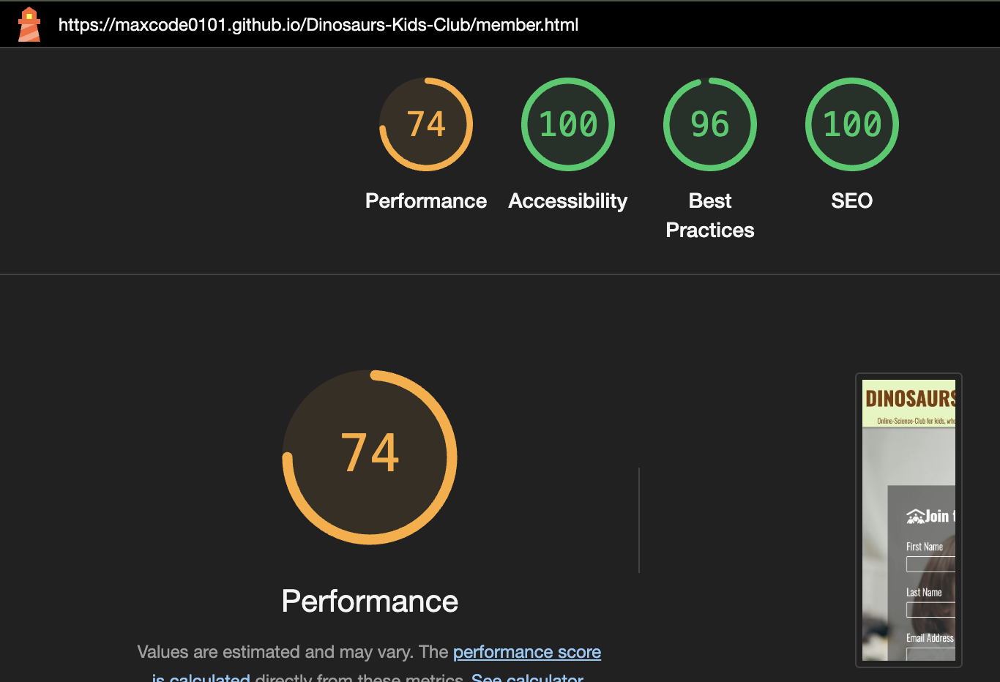
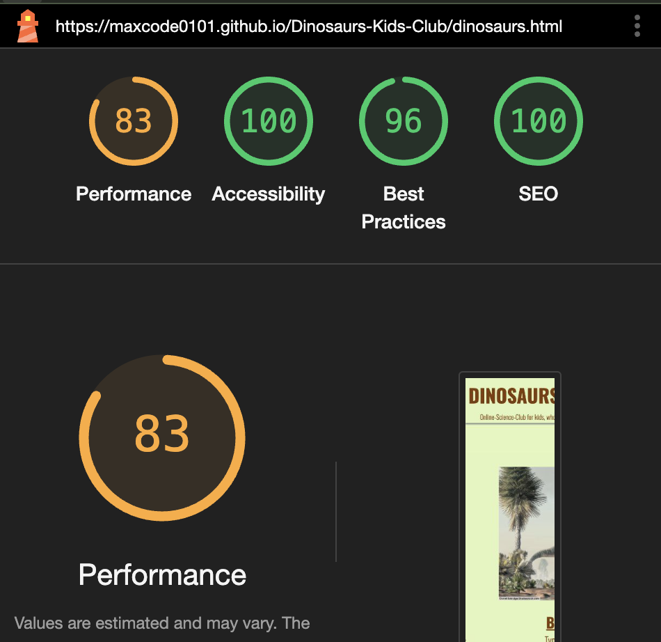

# Testing

> [!NOTE]  
> Return back to the [README.md](README.md) file.

Feature-by-Feature Testing:

I was navigating through all parts of the deployed website in desktop version on a Mac-Book Pro with the Chrome-Browser. I´ve tested if the transitions between the different pages (about us; member; meet the dinosaurs) are smooth.

I scrolled up and down the home-page and checked if it displays correct and all elements are in the right place with a good visibility.

I scrolled up and down the member-page and checked if it displays correct and all elements are in the right place with a good visibility.

I scrolled up and down the meet-the dinosaurs-page and checked if it displays correct and all elements are in the right place with a good visibility.

I was testing the hover function on all of the pages.

I was testing if the links to the social-networks in the footer are working properly and opening a separate window with the correct destination. 

I tested the sign-up form in the member section. I was testing if all the required fields (first name; last name; email-address) are mandatory to send the form. I was testing if the confirmation-page for the form is beeing displayed and working properly and is redirecting to the home-page.

I was testing if the 404 page displays and redirects to the home-page properly.

I opened the Dev-Tools in the Crome-Browser and repeated all of the steps above for all of the devices provided screen-sizes.

I opened the deployed website on my Iphone 13 Pro with Safari- and Chrome-Browser and repeated all the testings above.

During the Feature-by-Feature Testing no bugs have been encountered.

User Experience and Usability Testing:

I was sending the deployed link to three independent test-users.

Feedback-User1 (Iphone 8 with Safari Browser): Everything works well, website is easy to use. Submitting of form was working well." 

Feedback-User2 (Iphone Safari Browser): "With Safari on the Iphone everythings alright during a fast check"

Feedback-User3 (SamsungS20 with Chrome-Browser): "Could navigate through the website easily"

During the User-Testing no issues have been encountered.

Accessibility Testing: Confirm compliance with accessibility standards (e.g., screen reader compatibility, proper alt text for images, keyboard navigation).

I´ve used the hover function in the Chrome-Devtools to make sure the used background/font-color combination provides a good readability on the screen
----SCREENSHOT----

While testing the alt-attributes of the images I´ve found brachio and spino to be not specific enough. I´ve changed them to brachiosaurus and spinosaurus.
----SCREENSHOT----

While testing the keyboard navigation, I´ve encountered that the Burger-Menu isn´t accessible via keyboad-navigation. I´ve decided to not focus on fixing the bug. I found it to be a problem of a very limited audience, as most users are going to access the page via Smartphone, Tablet, Laptop or Desktop-Computer with mouse. The benefit ist to small to justify the effort in my opinion.

Compatibility Testing:

- Chrome-Browser

- Firefox Developer Edition

- Safari

Performance Testing:
	
---Screenshot---

Regression Testing:

Changes have been made to the alt attributes which have been tested and don´t effect the page in any way.

## Code Validation

### HTML

I have used the recommended [HTML W3C Validator](https://validator.w3.org) to validate all of my HTML files.

| Directory | File | Screenshot | Notes |
| --- | --- | --- | --- |
|  | 404.html |  | |
|  | confirmation.html |  | |
|  | dinosaurs.html |  | |
|  | index.html |  | |
|  | member.html |  | |

### CSS

I have used the recommended [CSS Jigsaw Validator](https://jigsaw.w3.org/css-validator) to validate all of my CSS files.

| Directory | File | Screenshot | Notes |
| --- | --- | --- | --- |
| assets | style.css |  | |

## Browser Compatibility

Browsers tested:
- [Chrome](https://www.google.com/chrome)
- [Firefox (Developer Edition)](https://www.mozilla.org/firefox/developer)
- [Safari](https://support.apple.com/downloads/safari)

I've tested my deployed project on multiple browsers to check for compatibility issues.

| Browser | Home | About | Contact | etc | Notes |
| --- | --- | --- | --- | --- | --- |
| Chrome |  |  |  |  | Works as expected |
| Firefox |  |  |  |  | Works as expected |
| Safari |  |  |  |  | Minor CSS differences |

## Responsiveness

| Device | Home | About | Contact | etc | Notes |
| --- | --- | --- | --- | --- | --- |
| Mobile (DevTools) |  |  |  |  | Works as expected |
| Tablet (DevTools) |  |  |  |  | Works as expected |
| Desktop |  |  |  |  | Works as expected |

## Lighthouse Audit

I've tested my deployed project using the Lighthouse Audit tool to check for any major issues.

| Page | Mobile | Desktop | Notes |
| --- | --- | --- | --- |
| About us |  |  | Some minor warnings |
| Member |  |  | Some minor warnings |
| Meet the dinosaurs |  |  | Slow response time due to large images |

## Bugs

-While testing the alt-attributes of the images I´ve found brachio and spino to be not specific enough. I´ve changed them to brachiosaurus and spinosaurus.

-Some duplicated id-tags have been replaced against class-attributes.

-some h1 headings whicht hadn´t been on top of the page, have been replaced against h2 headings.

## Unfixed Bugs

While testing the keyboard navigation, I´ve encountered that the Burger-Menu isn´t accessible via keyboad-navigation. I´ve decided to not focus on fixing the bug. I found it to be a problem of a very limited audience, as most users are going to access the page via Smartphone, Tablet, Laptop or Desktop-Computer with mouse. The benefit ist to small to justify the effort in my opinion.

By accident I wrote "git push" inside one of the commit messages. I´m aware of it, in order to not risk a bigger error, I´m not trying to repair it though.

> [!NOTE]  
> There are no remaining bugs that I am aware of.
